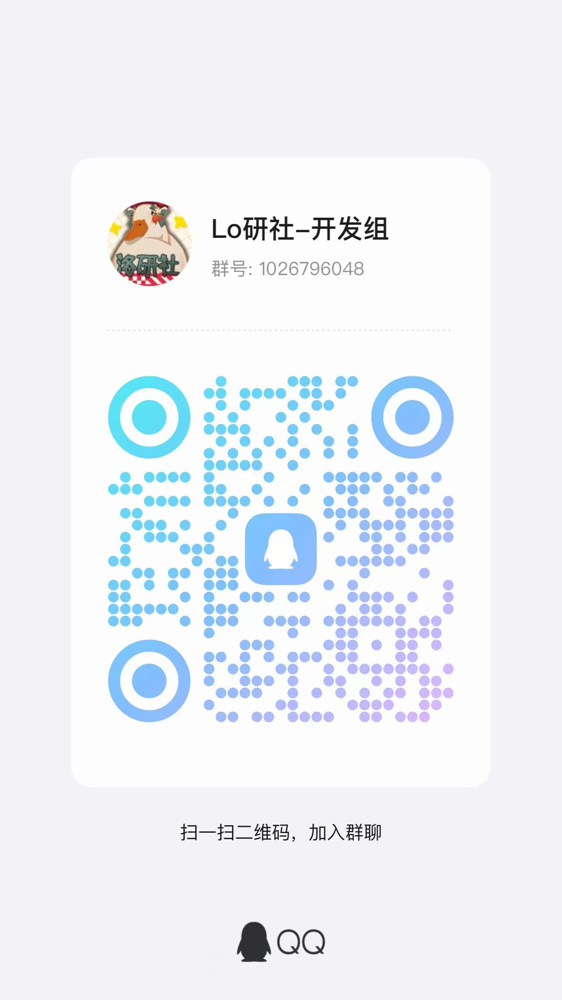
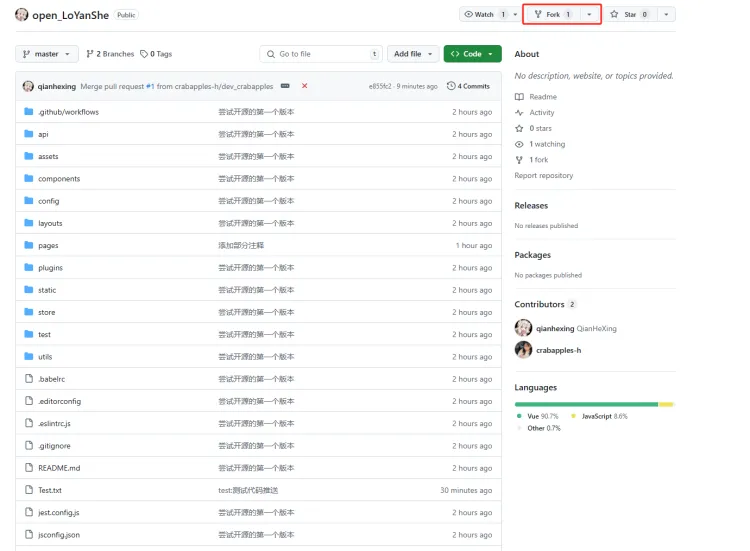
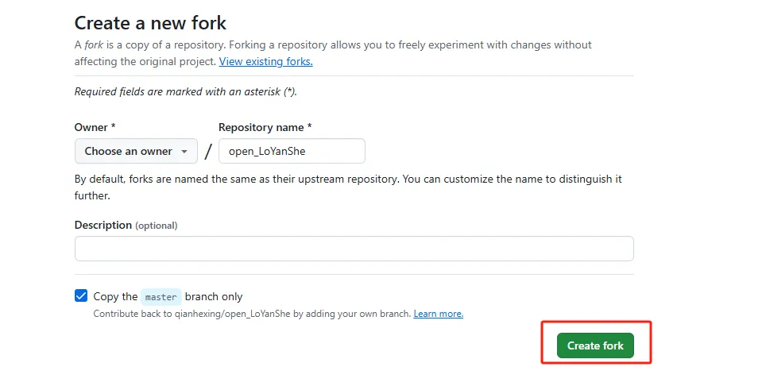
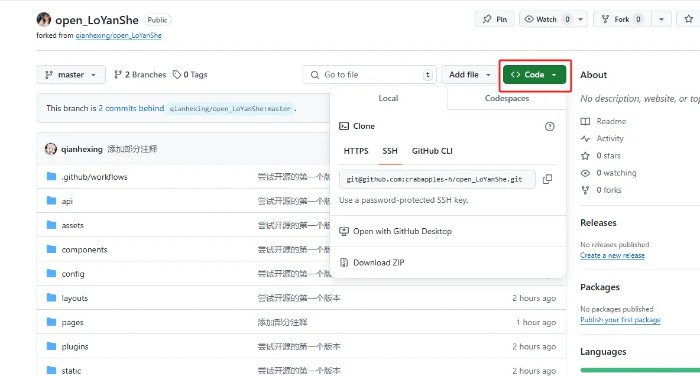
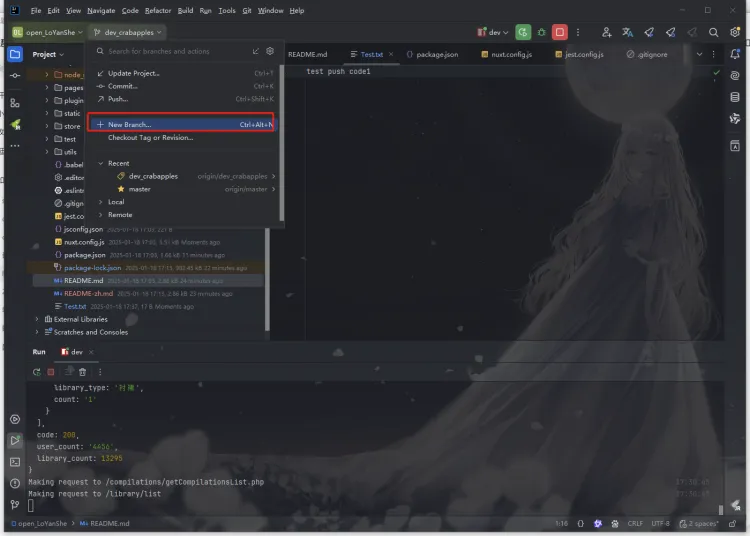
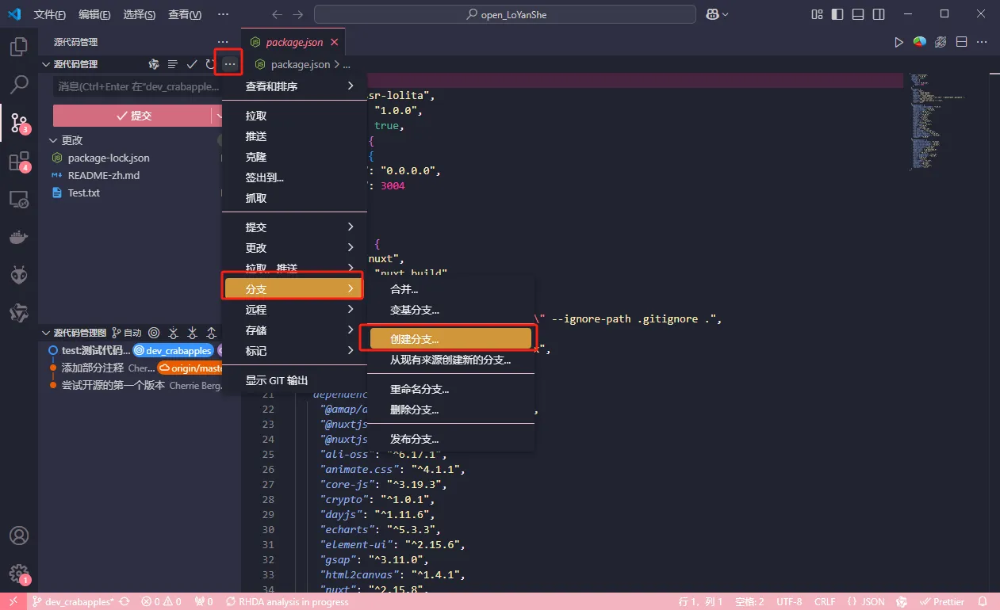
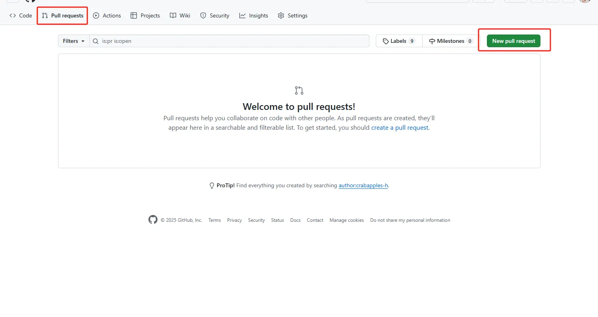

# 1.访问lo研社git仓库
`https://github.com/qianhexing/open_LoYanShe`

---

# 2.fork仓库

---

# 3.将代码拉取到本地

---

# 4.新建一个分支
- `jetbrains`系列

- `vscode`

- `命令行`

`git branch <branch_name>`

`git checkout <branch_name>`

---

# 5.提交代码
*开发者应该都会的吧，就不多赘述啦~*

---

# 6.创建pr(pull request)

---

# 7.最后一步
耐心等待就行啦~
